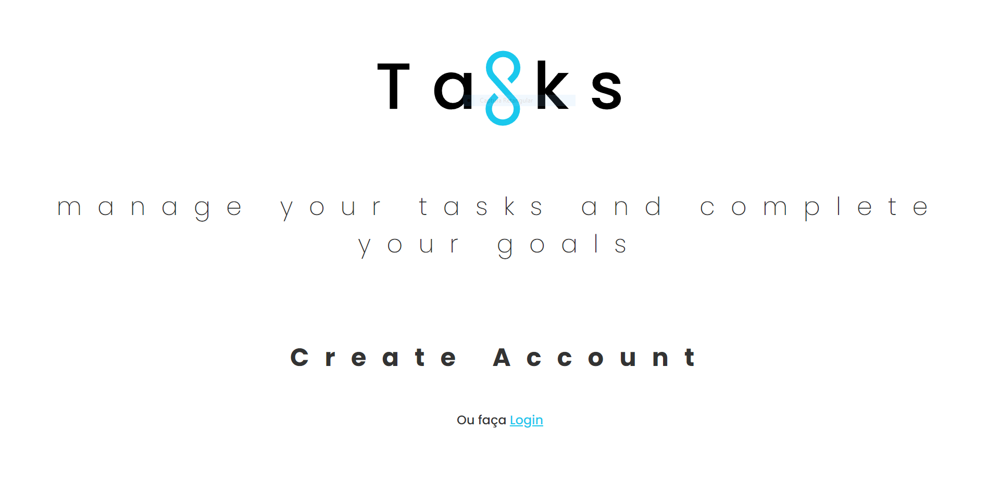

# Tasks - manage your tasks and complete your goals

Um projeto no estilo TO-DO para anotar suas tarefas do dia a dia e organizar a sua rotina, se tornando mais produtivo.

## Lessons Learned

Esse é definitivamente o meu maior projeto já realizado e sem duvidas o com mais aprendizado durante o desenvolvimento.

Feito totalmente do ZERO por mim, desde a parte do "FrontEnd", "BackEnd" & "Design".

## 🛠 Skills Used

#### FrontEnd | ReactJS, NextJS, TypeScript, StyledComponents, React-Hook-Form, Axios.

#### BackEnd | NodeJS, ExpressJS, MongoDB, TypeScript, JWT.

#### Design | Figma.

## Screenshots

## 🔗 Links

## 🚀 About Me

Me chamo Victor, tenho 18 anos e sou Desenvolvedor FullStack ReactJS, NodeJS e UI Designer
